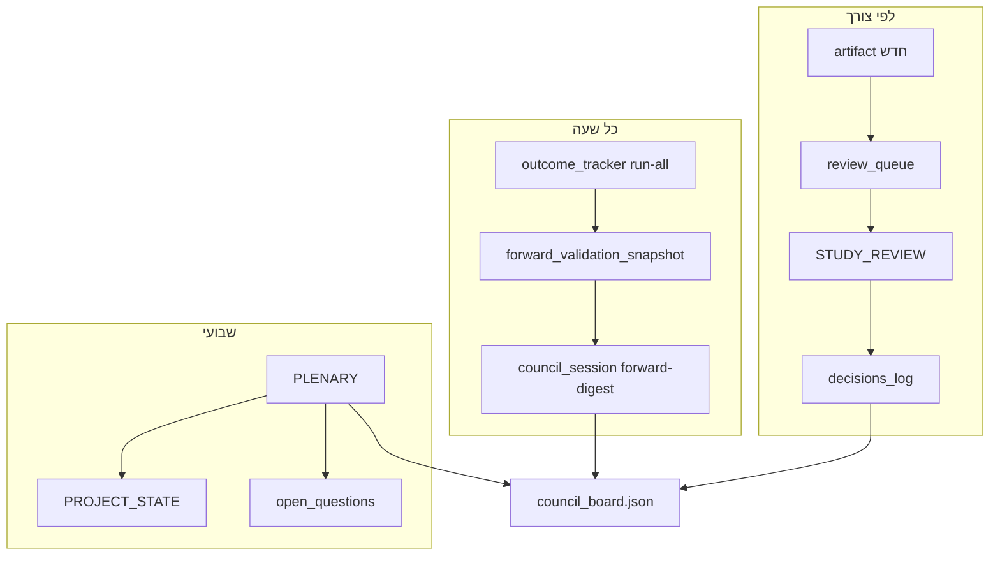

# FADE — מועצת בקרה (Council v2)

עודכן: **2026-07-23**

מועצה **קבועה** — לא רק Phase 2. מפקחת על holdout studies, forward validation, scope, וקידום ל-production.

## כוכב צפון (מחייב)

- **יעד סופי:** חיזוי מראש → מסחר → רווח כלכלי נטו.
- **גישה עכשיו:** מחקר — אין עדיין שיטה סחירה מוכחת.
- פסק ADVANCE / VALIDATED נמדד מול אופק **PnL נטו**, לא hit-rate לבדו.
- מחקר בלי אופק רווח = סטייה; «רווח» בלי אמת (lockbox/forward/pre-reg) = סטייה.

---

## שלוש שכבות אמת

| שכבה | מקור | מי בודק |
|------|------|---------|
| **exploratory** | holdout 70/30, artifacts JSON | מבקר + סCEPTיק + מדדן |
| **forward live** | ledgers + snapshot | Forward Watcher |
| **production** | path_lean3 core | Gatekeeper — רק אחרי forward validated |

---

## תפקידים (מורחב)

| תפקיד | סוכן | אחריות | תדירות |
|--------|------|---------|--------|
| **יושב-ראש** | chat ראשי / generalPurpose | מחלק משימות, קובע סדר יום, מעדכן board | לפי round |
| **בונה** | generalPurpose × N | pipeline + artifact | לפי משימה |
| **סייר** | explore | נתונים, CSV, API keys | לפני כל build |
| **מבקר** | bugbot / readonly | SCOPE_GUARD, look-ahead, lockbox v1 | כל artifact |
| **סCEPTיק** | readonly | confounds, p-hacking, non-stationarity | כל artifact |
| **מדדן** | readonly | ספים מ-pre_registration | כל artifact |
| **Forward Watcher** | readonly / automated | snapshot, milestones, drift | **כל שעה** (Action) |
| **Gatekeeper** | readonly | אין atoms/core בלי pre-reg + council ADVANCE | לפני כל merge ל-core |
| **ארכיונאי** | readonly | PROJECT_STATE, decisions_log, תיעוד | אחרי plenary |
| **Red Team** | readonly | ניסיון לשבור invariants; adversarial review | שבועי / לפני ADVANCE |
| **Ideator** | propose | hypotheses + pre-mortem | לפי בקשה |
| **Historian** | readonly | graveyard dedup — `council_research` | כל רעיון חדש |

**ועדת מחקר:** `docs/COUNCIL_RESEARCH.md` | `council_research.json` — **מחקר בלבד**, לא build עד RESEARCH_APPROVE.

---

## סוגי ישיבות (sessions)

| session_type | מתי | פלט |
|--------------|-----|-----|
| **FORWARD_DIGEST** | כל שעה (GitHub Action) | `council_digest.json` |
| **STUDY_REVIEW** | artifact חדש ב-review_queue | שורה ב-`decisions_log` |
| **PLENARY** | שבועי / לפי בקשה | סיכום + `open_questions` |
| **MILESTONE** | 25/100/500 forward signals | `milestones_log` |
| **INCIDENT** | BLOCKED / invariant break | `incidents_log` — עדיפות גבוהה |
| **RESEARCH_SCAN** | לפי בקשה | `council_research scan` |
| **RESEARCH_PLENARY** | שבועי | דירוג backlog + pre-reg המלצות |

---

## פסקי דין

| פסק | holdout | forward | production |
|-----|---------|---------|------------|
| **ADVANCE** | עומד בסף | — | pre-register forward track |
| **WATCH** | רמז חלקי | אוסף נתונים | המשך ניטור |
| **REJECT** | סגור study | — | לא קידום |
| **BLOCKED** | תיקון חובה | — | stop the line |
| **VALIDATED** | — | עומד ב-criteria | **רק המשתמש** מאשר core |

---

## review_queue — כל artifact חדש

כל קובץ ב-`fade/output/` שמסתיים ב:
- `*_holdout.json`, `phase2_*.json`, `*_screen.json`, `ml_*.json`

חייב להיכנס ל-`review_queue` ב-board. המועצה לא סוגרת track בלי STUDY_REVIEW.

---

## Forward milestones (Track A / ETH)

| milestone | trigger | council action |
|-----------|---------|----------------|
| M25 | 25 scored sparse signals | FORWARD_DIGEST alert |
| M100 | 100 hold-cycles ETH | MILESTONE session — VALIDATED? |
| M500 | 500 sparse PRIMARY | MILESTONE — Track A review |
| M90 | 90d forward data | Track E decay meter opens |

---

## זרימה — standing council



---

## פקודות

```bash
# digest שעתי (גם ב-GitHub Action)
python -m fade.pipeline.council_session forward-digest

# plenary — סיכום מצב מועצה
python -m fade.pipeline.council_session plenary

# הוסף artifact לתור review
python -m fade.pipeline.council_session enqueue fade/output/foo_holdout.json --study-id foo_v1

# study review אוטומטי (מבקר + מדדן בסיסי)
python -m fade.pipeline.council_session review-next
```

---

## פרומpt — Forward Watcher (שעתי)

```
Full Repository Path: C:\Users\Yonat\Projects\FADE_PROJECT
Readonly: true
Read fade/output/forward_validation_snapshot.json and fade/output/council_board.json.
Check milestones M25/M100/M500/M90. Flag hit-rate drift vs target 0.58.
Append FORWARD_DIGEST to council_digest.json — do NOT change production code.
If milestone crossed, add MILESTONE entry to milestones_log in council_board.json.
```

---

## פרומpt — PLENARY (שבועי)

```
Full Repository Path: C:\Users\Yonat\Projects\FADE_PROJECT
Readonly: true
Review: council_board.json, council_digest.json, forward_validation_snapshot.json, decisions_log (last 10).
Produce: open_questions (max 5), track status summary, recommend next builder tasks.
Update council_board.json plenary section only.
```

---

## פרומpt — Red Team (לפני ADVANCE)

```
Full Repository Path: C:\Users\Yonat\Projects\FADE_PROJECT
Readonly: true
Adversarial review of artifact + pipeline source. Try to find look-ahead, label leak, duplicate counting, fee optimism.
Output: red_team_report in council_board.json — pass/fail. Fail = BLOCKED.
```

---

## קבצים

| קובץ | תפקיד |
|------|--------|
| `fade/output/council_board.json` | לוח, queues, logs |
| `fade/output/council_digest.json` | digest שעתי אחרון |
| `fade/output/forward_validation_snapshot.json` | forward truth |
| `docs/PHASE2_COUNCIL.md` | היסטוריית Phase 2 rounds 1–3 |
| `docs/FADE_COUNCIL.md` | charter זה |

---

## כללים

1. מועצה **readonly** — לא מתקנת קוד (חוץ מ-board/digest JSON).
2. בונים לא קובעים verdict סופי.
3. Gatekeeper חוסם כל שינוי ב-`atoms.py` / `path_lean3` בלי VALIDATED forward.
4. אחרי PLENARY — ארכיונאי מעדכן `PROJECT_STATE.md` (סעיף council בלבד).
5. אין commit אלא אם המשתמש מבקש.

---

## Phase 2 — סטטוס (היסטוריה)

| Track | פסק |
|-------|-----|
| A | forward — Forward Watcher |
| B | rules REJECT; ML sandbox WATCH |
| C | REJECT |
| D | REJECT |
| E | ממתין M90 |

פרטים: `docs/PHASE2_COUNCIL.md` + `decisions_log`.
