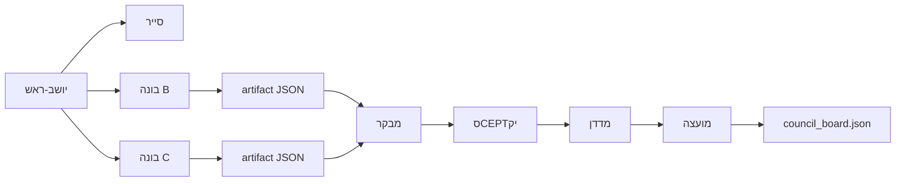

# Phase 2 — מועצת בקרה וסוכנים

> **מועצה v2 (standing):** ראה `docs/FADE_COUNCIL.md` — charter מורחב, Forward Watcher, Plenary, Red Team.

עודכן: **2026-07-05**

מסגרת עבודה לפיצול משימות בין סוכנים Cursor + מועצה שמבקרת תוצאות לפי יעדים pre-registered.

---

## עקרונות

1. **אף סוכן לא מקדם ל-production** — רק המועצה ממליצה; המשתמש מאשר forward track.
2. **כל תוצאה = artifact JSON** — לא "נראה טוב" בצ'אט.
3. **holdout = exploratory** — forward live = אמת.
4. **SCOPE_GUARD תמיד** — מבקר יכול לחסום (BLOCKED) בלי קשר ל-hit-rate.

---

## תפקידים

| תפקיד | סוכן Cursor | אחריות | readonly? |
|--------|-------------|---------|-----------|
| **יושב-ראש** | `generalPurpose` (או צ'at ראשי) | מחלק משימות, מזמן מועצה, מעדכן `council_board.json` | — |
| **בונה** | `generalPurpose` × N (אחד ל-track) | מימוש pipeline + הרצה + כתיבת artifact | לא |
| **סייר** | `explore` | נתונים, קבצי CSV, כיסוי, API keys חסרים | כן |
| **מבקר** | `bugbot` או `generalPurpose` readonly | look-ahead, ML ב-core, lockbox v1, atoms לא רשומים | כן |
| **סCEPTיק** | `generalPurpose` readonly | confounds, p-hacking, cherry-pick, non-stationarity | כן |
| **מדדן** | `generalPurpose` readonly | השוואה לספים ב-`pre_registration.json` | כן |

---

## פסקי דין (verdicts)

| פסק | משמעות | צעד הבא |
|-----|---------|---------|
| **ADVANCE** | עומד בסף holdout + עבר מבקר וסCEPTיק | pre-register forward track; לא atoms ב-core |
| **WATCH** | רמז חלקי / היסטוריה קצרה / n קטן | המשך ניטור; לא קידום |
| **REJECT** | לא עומד בסף או מנגנון לא עובד | סגור track; תיעוד ב-board |
| **BLOCKED** | הפרת invariant | תיקון לפני כל דיון |

---

## זרימת עבודה (round)



### Round 0 — כבר רץ (ללא מועצה)
- Track **A**: forward sparse PRIMARY + ETH candidate
- Track **E**: decay meter — ממתין ל-n forward

### Round 1 — מקביל (הבא)
| משימה | בונה | deliverable |
|--------|------|-------------|
| B | `vol_range_holdout.py` | `fade/output/phase2_b_vol_range.json` |
| C | `cross_asset_spread_holdout.py` | `fade/output/phase2_c_cross_spread.json` |
| Scout | אימות `*_1h.csv` + BTC pairs | שורה ב-board: `data_ok` |

### Round 2 — מועצה (readonly)
1. מבקר — checklist SCOPE_GUARD
2. סCEPTיק — confound report (3 נקודות max)
3. מדדן — hit vs threshold מ-pre_registration
4. יושב-ראש — verdict + `decisions_log`

### Round 3 — רק ADVANCE
- Track **D** נפתח רק אם B או C קיבלו ADVANCE/WATCH עם מנגנון ברור
- FSM ב-sandbox; לא מחליף path_lean3

---

## תבנית artifact (חובה לכל בונה)

```json
{
  "study_id": "phase2_b_vol_range_v1",
  "run_utc": "ISO-8601",
  "agent": "builder-vol-range",
  "data_split": "holdout_70_30_exploratory",
  "assets": ["btc", "eth"],
  "metrics": {
    "baseline_hit": 0.0,
    "model_hit": 0.0,
    "lift_pp": 0.0,
    "n_test": 0,
    "p_value": null
  },
  "success_criteria_met": false,
  "confounds_flagged": [],
  "scope_check": {
    "no_lookahead": true,
    "no_ml_in_core": true,
    "historical_csv_only": true
  },
  "recommendation": "REJECT|WATCH|ADVANCE"
}
```

הבונה **לא** קובע verdict סופי — רק `recommendation`. המועצה קובעת.

---

## פרומптים לשיגור סוכנים (העתקה)

### בונה — Track B
```
Full Repository Path: ./
Task: Implement fade/pipeline/vol_range_holdout.py per phase2_b_vol_range_v1 in pre_registration.json.
Deliver: fade/output/phase2_b_vol_range.json matching council artifact template in docs/PHASE2_COUNCIL.md.
Constraints: holdout 70/30, no look-ahead, historical CSV only. ML allowed ONLY inside this exploratory study — NOT in atoms.py or path_lean3.
Do NOT update production core.
```

### בונה — Track C
```
Full Repository Path: ./
Task: Implement fade/pipeline/cross_asset_spread_holdout.py per phase2_c_cross_spread_v1.
Pairs: eth/btc, sol/btc, rose/btc, pepe/btc from existing 1h CSVs.
Deliver: fade/output/phase2_c_cross_spread.json
Same constraints as Track B.
```

### מועצה — review batch
```
Full Repository Path: ./
Readonly: true
Review artifacts: fade/output/phase2_b_vol_range.json, fade/output/phase2_c_cross_spread.json
Against: pre_registration.json success criteria + docs/SCOPE_GUARD.md invariants.
Output: update fade/output/council_board.json decisions_log with verdict per track, auditor_pass, skeptic_notes, metrician_pass.
Verdicts: ADVANCE | WATCH | REJECT | BLOCKED only.
```

---

## קבצים

| קובץ | תפקיד |
|------|--------|
| `fade/output/council_board.json` | לוח משימות + decisions_log |
| `fade/output/pre_registration.json` | ספי הצלחה רשמיים |
| `docs/SCOPE_GUARD.md` | invariants — מבקר |
| `docs/PROJECT_STATE.md` | סיכום executive |

---

## כללי תיאום

- **מקסימום 2 בונים במקביל** (B+C) — מונע התנגשויות merge
- **מועצה תמיד readonly** — לא מתקנת קוד, רק מדווחת BLOCKED
- **אחרי כל round** — יושב-ראש מעדכן `PROJECT_STATE.md` (סעיף Phase 2 בלבד)
- **אין commit** אלא אם המשתמש מבקש
